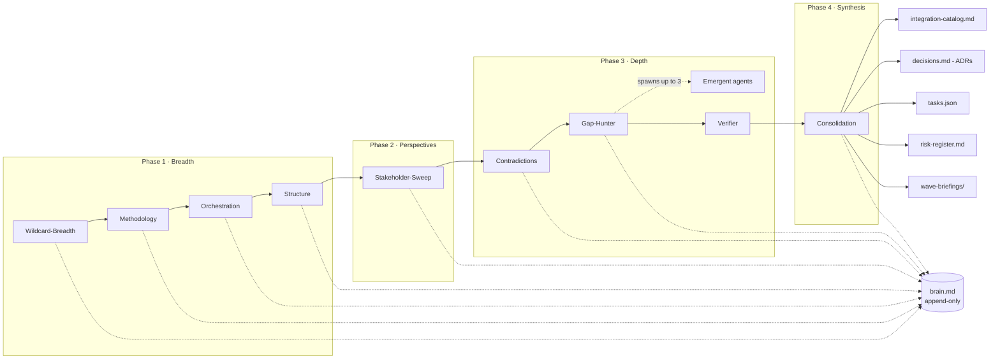

# Gap-Hunter Pattern

> **Find the blind spots before you build them.** A multi-agent overnight research pattern for Claude Code that knows when not to run.

A sequential agent chain with a dedicated meta-agent for blind-spot detection. Designed to surface unknown-unknowns, stakeholder concerns, and time-horizon contradictions **before** an execution phase — not after, when fixing them is expensive.

The triage mode is allowed (and encouraged) to recommend NOT running the pattern when a simpler path fits. No other research tool ships with that filter.

---

## The pain this addresses

You know the feeling. Three months into a sprint, somebody flags that the auth provider you chose can't do SSO at the tier you announced. Or that the billing model assumes a usage pattern your enterprise customers won't accept. Or that the ML eval methodology you locked in misses a fairness dimension that turns into a public incident.

These mistakes are rarely made when the wrong decision is taken. They are made when a **contradiction** between two decisions, or a perspective nobody surfaced, is left unresolved at decision time — and surfaces six months later as a forced rewrite.

You can:
1. Skip research and rebuild later
2. Run a single deep prompt and get a generic surface-level answer
3. Spawn fifteen parallel agents and spend a week debugging coordination
4. Run a sequential chain with a dedicated agent whose only job is finding what nobody else thought to ask

This is option 4.

---

## What makes this different

| Tool | Promises | Gap-Hunter promises |
|---|---|---|
| Anthropic's Multi-Agent Research | "Deeper web research" | "Pre-execution research with operational output" |
| DeepResearch (verified facts) | "Here are the verified claims" | "Here are the gaps in your plan" |
| Workflow-orchestration plugins | "Orchestrate code changes" | "Ask the right questions before the code changes" |
| Large agent collections | "Buffet of agents" | "Opinionated pattern with documented rationale" |

Concretely:

- **Triage can say "no".** Most tools sell themselves; this one tells you when a single web search would suffice.
- **Adaptivity in a single dedicated meta-agent.** The Gap-Hunter is a single-responsibility blind-spot finder, not a rule engine in the orchestrator. This is the architectural insight that makes the pattern work — see [`docs/anti-patterns.md`](docs/anti-patterns.md).
- **Six approaches we rejected, with reasoning.** Parallel agent armies, persona theatre, divergence/convergence splits, rule-engines for emergent spawning, blackboard coordination, external multi-agent tools — each was tried, each failed in a documented way. The pattern is the thinnest viable system after rejecting them.
- **Output is operational, not informational.** Five derived artefacts (catalogue + ADRs + tasks.json + risk register + wave briefings) drop directly into your tracker, decision log, and next execution prompt.
- **Verifier with sidecar pattern.** The Gap-Hunter is rewarded for finding things others missed — which creates an incentive to invent gaps. The Verifier cross-checks every claim against the research log, marks false-positives, and emits a quality signal that the consolidator honours.

Full landscape analysis in [`docs/competitive-landscape.md`](docs/competitive-landscape.md).

---

## The chain



Every agent reads `brain.md`, runs, appends its findings. The Gap-Hunter reads everything and explicitly searches for what is missing. The Verifier cross-checks the Gap-Hunter to prevent hallucinated gaps. The Consolidation agent produces the integration catalogue plus the four operational artefacts.

---

## What you get back

After a `plan` run, your `strategy/` directory contains:

| File | Purpose |
|---|---|
| `integration-catalog.md` | Synthesised research catalogue with Must / Should / Could / Rejected recommendations |
| `decisions.md` | Architecture Decision Records — one per Must-recommendation |
| `tasks.json` | Importable into Linear, GitHub Issues, Jira |
| `risk-register.md` | Contradictions register reformatted as trackable risks with owner slots |
| `wave-briefings/` | Execution-ready briefings — paste directly into a fresh Claude session as a sub-agent prompt |

Plus `brain.md` — the append-only research log that stays open during execution for ongoing findings.

A canonical example with all artefacts populated lives at [`examples/saas-feature-launch/`](examples/saas-feature-launch/).

---

## Quick start

The Gap-Hunter is distributed as a Claude Code plugin via this repository's marketplace.

**1. Register the marketplace** (one-time, in any Claude Code session):

```
/plugin marketplace add 0zoriginalss-ux/gap-hunter
```

**2. Install the plugin** (one-time):

```
/plugin install gap-hunter@gap-hunter
```

**3. From your project directory, start a research run:**

```
/gap-hunter:gap-hunt-triage
```

The triage step takes ~10 minutes and tells you honestly whether the full pattern fits your situation. If it does, it routes you to the right mode.

---

## Four modes, one decision rule

| Mode | Slash command | Use when | Approximate runtime |
|---|---|---|---|
| Triage | `/gap-hunter:gap-hunt-triage` | You are unsure whether to run the pattern at all | ~10 minutes |
| Explore | `/gap-hunter:gap-hunt-explore` | Scope is not yet fixed; you need to map the landscape | ~1-2 hours |
| Plan | `/gap-hunter:gap-hunt-plan` | Scope is clear; you are about to commit to architecture or build | ~4-6 hours (overnight) |
| Validate | `/gap-hunter:gap-hunt-validate` | You shipped one wave; reconcile assumptions with reality before the next | ~2-3 hours |
| Resume | `/gap-hunter:gap-hunt-resume` | An interrupted run needs to continue from the last completed agent | varies |

**Always start with triage** if you are not sure. The triage agent is allowed (and encouraged) to recommend NOT running the pattern when a simpler path fits.

---

## Six approaches we rejected

Behind every design choice in this pattern is something that did not work. The full reasoning is in [`docs/anti-patterns.md`](docs/anti-patterns.md), but the headlines:

1. **Parallel agent army without a chain** — no learning effect, redundant research, six monologues
2. **Six separate persona agents** — stakeholder theatre, marginal differences, conflicts invisible
3. **Divergence/convergence phase split** — ceremony without measurable quality gain
4. **Five-trigger rule engine for emergent spawning** — guard-rail bugs, never covers the cases that matter
5. **Full blackboard coordination** — file-lock chaos, race conditions, debug nightmare for an overnight batch
6. **Integrating external multi-agent tools mid-run** — setup overhead dwarfs the gain, fails at the worst time

The thread connecting all six: adaptivity belongs in a single dedicated meta-agent, not in the orchestrator's rule engine, not in distributed coordination, and not in N parallel role-players.

---

## What this costs

The pattern uses Claude Opus and Claude Sonnet through your existing Claude Code subscription or API key. Honest expectations:

- **Triage** runs a single fast agent; it is the cheapest part of the pattern by an order of magnitude
- **Explore** runs a reduced chain of three research agents plus the verifier and consolidator
- **Plan** runs the full chain — eight research agents, a verifier, a consolidator, and up to three emergent follow-up agents

The honest answer to "what does a full plan run cost?" depends on your subscription tier, the verbosity of your shared-context, and how many emergent agents the Gap-Hunter spawns. Plan runs are designed for overnight batches because that is the regime where the cost is justified by the decision being made.

For Claude Pro/Max users on a 7-day rolling window, a full plan run consumes a meaningful fraction of the window — see [`docs/pattern.md`](docs/pattern.md) for the rate-limit fallback strategy.

---

## Privacy

Everything runs locally. The pattern reads files from your project directory and writes outputs back. `brain.md`, the agent outputs, the integration catalogue, and all derived artefacts stay on your machine. No telemetry. No uploaded data. The Verifier's quality signal is a local file. The optional dashboard parses `brain.md` in your browser without a server.

If you operate in a compliance-heavy domain, the pattern was designed with this in mind — see the [`compliance-heavy` adaptor](plugins/gap-hunter/adaptors/compliance-heavy.yaml).

---

## Adaptors

The pattern adapts to your domain through one of five adaptors. Each pre-populates stakeholders, methodology focus, and contradiction-detection emphasis.

| Adaptor | For projects that |
|---|---|
| [`saas-feature`](plugins/gap-hunter/adaptors/saas-feature.yaml) | Ship into multi-tenant SaaS with billing and tenant isolation |
| [`ml-model`](plugins/gap-hunter/adaptors/ml-model.yaml) | Train, deploy, or significantly retrain ML models |
| [`hardware`](plugins/gap-hunter/adaptors/hardware.yaml) | Build embedded, IoT, robotics, or consumer hardware |
| [`compliance-heavy`](plugins/gap-hunter/adaptors/compliance-heavy.yaml) | Operate in healthcare, finance, public sector, regulated industry |
| [`generic`](plugins/gap-hunter/adaptors/generic.yaml) | Mix domains or fall outside the above |

Writing your own adaptor takes ~30 minutes — see [`docs/adaptors.md`](docs/adaptors.md).

---

## Example

[`examples/saas-feature-launch/`](examples/saas-feature-launch/) is a fully-populated canonical run of the pattern. It contains every artefact the chain produces — `_shared-context.md`, `brain.md`, the integration catalogue, ADRs, task list, risk register, and wave briefings — for a real-shaped pricing decision in a multi-tenant SaaS context.

Read it top-to-bottom to understand what the pattern delivers. The catalogue is what your team will work with; the rest is the audit trail that explains how the catalogue arrived at its recommendations.

---

## Live observability

During a run, open `plugins/gap-hunter/dashboard.html` in your browser and load `brain.md`. You see agent progress, findings as they accumulate, and a stale-warning if no agent has appended in the last 30 minutes. No server, no build step.

For overnight runs, the watchdog scripts in `plugins/gap-hunter/scripts/` (Bash + PowerShell) run in a separate terminal and fire a system notification on staleness. Catches the most common silent failure: an agent hangs while the orchestrator waits.

---

## Resume capability

Runs can be interrupted by rate limits, network failures, or context compaction. State persists in `.gap-hunter/state.json` and the orchestrator plan in `.gap-hunter/plan.md`. Resume from the last completed agent:

```
/gap-hunter:gap-hunt-resume
```

---

## Documentation

- [`docs/pattern.md`](docs/pattern.md) — full pattern description
- [`docs/anti-patterns.md`](docs/anti-patterns.md) — six rejected approaches with reasoning
- [`docs/extending.md`](docs/extending.md) — Living brain.md, Context-Hardening Chain, multi-AI integration
- [`docs/adaptors.md`](docs/adaptors.md) — how to write your own adaptor
- [`docs/competitive-landscape.md`](docs/competitive-landscape.md) — positioning against related tools

---

## Repository structure

This repository is a **Claude Code plugin marketplace** containing one plugin:

```
gap-hunter/                          (marketplace root)
├── .claude-plugin/marketplace.json  (marketplace manifest)
├── plugins/
│   └── gap-hunter/                  (the plugin)
│       ├── .claude-plugin/plugin.json
│       ├── agents/                  (10 agent briefings)
│       ├── commands/                (6 slash commands)
│       ├── skills/gap-hunter/SKILL.md
│       ├── adaptors/                (5 domain adaptors)
│       ├── scripts/                 (init, smoke-test, watchdog, resume, post-process)
│       └── dashboard.html
├── README.md, LICENSE, CHANGELOG.md, CONTRIBUTING.md
├── docs/                            (pattern docs)
└── examples/                        (canonical example run)
```

---

## Roadmap

**v1.1 — Adaptive Coach (planned).** A per-user coach that learns your team's recurring blind spots over multiple runs. After a few runs, the coach surfaces patterns: which stakeholders you tend to forget, which severity classifications you tend to inflate, which adaptor overrides you make every time. The coach feeds these into Triage as personalised priors. Pattern stays the same; the system gets to know you.

The pattern's design discipline stays the same as well — additive, opt-in, local-only.

---

## Status

v1.0. Stable architecture, opinionated. Contributions welcome — see [`CONTRIBUTING.md`](CONTRIBUTING.md).

The pattern is deliberately small and stays small. The goal is not feature breadth; it is consistent, defensible pre-execution research that lands operationally.

---

## License

MIT — see [`LICENSE`](LICENSE).
